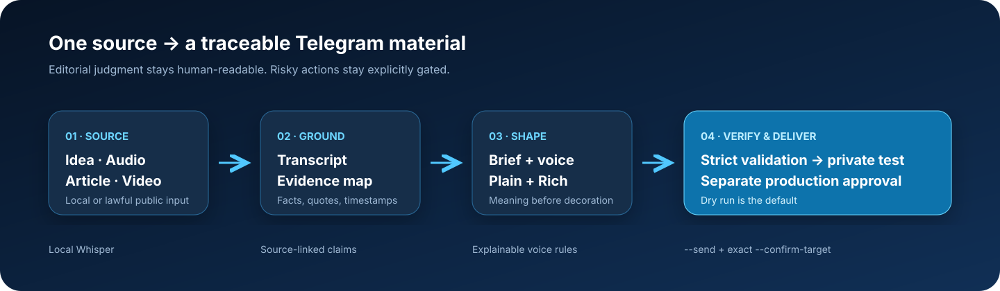

<div align="center">


# Telegram Rich Content Skill

**Turn a rough idea, voice note, article, document, podcast, or video into a
source-grounded Telegram post in your approved voice — from plain copy to a true Rich
Message with headings, tables, expandable sections, footnotes, media, and slideshows.**

[](https://github.com/shromarketing/telegram-rich-content-skill/releases)
[](https://github.com/shromarketing/telegram-rich-content-skill/actions)
[](LICENSE)
[](references/installation.md)
[](references/installation.md)

[Русская версия](README.ru.md) · [60-second setup](#60-second-setup) ·
[Showcase](docs/SHOWCASE.md) · [Security](docs/SECURITY_MODEL.md)

</div>

## Not another “AI post generator”

Most content tools start at the blank page and stop at generated copy. This skill gives
Codex or Claude Code a complete editorial workflow:

- start from text, audio, a URL, a document, YouTube, or several sources;
- transcribe locally with open Whisper runtimes — no paid speech-to-text API;
- build an evidence map before drafting, so claims stay traceable;
- onboard your tone of voice from approved examples without inventing a personality
  profile;
- choose the lightest useful format: plain post, manual Article, classic album, or Rich
  Message;
- validate Telegram Rich HTML against a strict allowlist before any network call;
- preview locally, test privately, and keep production behind a separate approval gate.



## Who it is for

- creators and founders who think in voice notes but publish structured long-form posts;
- editors and content teams turning interviews, articles, and videos into original
  Telegram materials;
- agencies that need repeatable, reviewable client workflows;
- developers experimenting with Telegram Bot API Rich Messages;
- Codex and Claude Code users who want a reusable editorial agent, not a one-off prompt.

It is not a bulk spammer, a copyright bypass, or an autonomous production publisher.

## What comes in the box

| Capability | What it does | Network by default? |
|---|---|---|
| Agent skill | Editorial routing, source grounding, onboarding, safety gates | No |
| Material package | Source → transcript → evidence → brief → post variants → QA | No |
| YouTube helper | Public metadata, original thumbnail, captions, or audio via `yt-dlp` | Yes |
| Local transcription | TXT, Markdown, SRT, VTT, JSON; checkpoints and word timestamps | Model download once |
| Voice guardrails | Explainable phrase, length, emoji, and CTA checks | No |
| Rich validator | Tags, attributes, URLs, limits, nesting, entities, media IDs | No |
| Local preview | Approximate browser rendering for faster iteration | No |
| Publishers | Rich Message, plain post, or 2–10 item photo/video album | Only with `--send` |
| Doctor | Installation checks; optional read-only Telegram diagnostics | No unless requested |

## 60-second setup

### Codex

```bash
git clone https://github.com/shromarketing/telegram-rich-content-skill.git \
  ~/.codex/skills/telegram-rich-content
```

### Claude Code

```bash
git clone https://github.com/shromarketing/telegram-rich-content-skill.git \
  ~/.claude/skills/telegram-rich-content
```

Restart the agent, then try:

```text
Use $telegram-rich-content. Turn this material into a detailed Telegram post in
my approved voice. Preserve the evidence, prepare plain and rich variants, validate
everything, and do not publish.
```

Codex and Claude Code both discover the repository through its root [`SKILL.md`](SKILL.md).
Project-local installation and Windows commands are in
[`references/installation.md`](references/installation.md).

## Optional tools: install only what you need

Helper scripts require Python 3.11+. Inspect the plan, apply it, and run the doctor
(replace `python3` with `python3.12`, for example, when the system interpreter is older):

```bash
python3 scripts/bootstrap.py --features all
python3 scripts/bootstrap.py --features all --apply
.venv/bin/python scripts/doctor.py
```

Feature groups are `publisher`, `youtube`, `transcription`, and optional Apple Silicon
`apple`. The installer creates an isolated `.venv`, never overwrites an existing `.env`,
and does not contact Telegram. Add `--init-env` only when publisher configuration is
needed. You can also install each `requirements-*.txt` manually.

## Start from anything useful

### A raw thought or voice note

The agent separates thesis from repetition, asks only questions that can change meaning,
and preserves useful depth instead of blindly shortening the source.

### An article or document

The agent separates source claims from your commentary, keeps links and attribution, and
creates a transformative post rather than copying the original.

### A YouTube video

```bash
python scripts/prepare_youtube.py 'https://youtu.be/VIDEO_ID' \
  --thumbnail --captions --language 'ru.*,en.*' --output-dir output/video
```

If captions are missing, acquire only audio and transcribe it locally:

```bash
python scripts/prepare_youtube.py URL --audio --output-dir output/video
python scripts/transcribe_audio.py output/video/VIDEO_ID.mp3 \
  --language ru --out output/video/transcript.md \
  --checkpoint output/video/progress.jsonl
```

Choose `txt`, `md`, `srt`, `vtt`, or `json`. `faster-whisper` is portable; optional
`mlx-whisper` accelerates Apple Silicon. No OpenAI API key or per-minute fee is required.
The first run may download model weights. See
[`references/youtube-workflow.md`](references/youtube-workflow.md).

## Make it sound like you — without a fake “voice score”

Give the agent 3–5 approved posts and ask it to draft a project-local voice profile. You
review the observable rules: audience, rhythm, vocabulary, directness, humor, formatting,
CTA, evidence habits, and anti-patterns. The profile stays editable.

For objective guardrails only:

```bash
python scripts/check_voice.py post-plain.md --profile style-check.json
```

The checker names every triggered rule. It never claims to measure authenticity,
personality, or writing quality. Start with
[`assets/voice-profile.template.md`](assets/voice-profile.template.md) and
[`assets/style-check.template.json`](assets/style-check.template.json).

## One auditable folder per material

```bash
python scripts/init_material.py "launch interview"
```

This creates:

```text
materials/launch-interview/
├── source.md                 # origin, rights, raw material
├── transcript.md             # timestamps and speaker labels
├── evidence-map.md           # claim → source → confidence
├── brief.md                  # audience, goal, CTA, constraints
├── voice-profile-used.md     # profile version and examples
├── post-plain.md             # compatible fallback
├── post-rich.html            # Telegram Rich Message
├── media/                    # explicit assets
└── validation-report.md      # technical and human acceptance
```

The complete synthetic example is in
[`examples/source-to-post`](examples/source-to-post).

## Validate and preview — nothing is sent

```bash
python scripts/validate_rich.py examples/source-to-post/post-rich.html
python scripts/preview_rich.py examples/source-to-post/post-rich.html \
  --out output/preview.html
```

The validator targets Telegram Bot API 10.3 and rejects unsupported tags/attributes,
event handlers, inline styles, unsafe URL schemes, malformed nesting, unsupported named
entities, documented limit overflows, and media-ID mismatches. The local preview is
explicitly approximate; Telegram Desktop and mobile remain authoritative.

## Safe Telegram delivery

Create a dedicated bot with `@BotFather`, add it only to a private test channel first,
and grant only **Post Messages**. Put secrets in a local `.env`; never paste them into an
agent prompt or commit them.

Dry run:

```bash
python scripts/publish_rich.py draft.html --photo cover=cover.jpg
python scripts/publish_fallback.py post-plain.md --mode plain
```

An actual test send requires two independent gates:

```bash
python scripts/publish_rich.py draft.html --photo cover=cover.jpg \
  --send --confirm-target=-1001234567890
```

Production additionally requires `--environment production`, but still cannot bypass
`--send` or exact target confirmation. A successful test is never permission to publish
to production. Full BotFather steps: [`references/botfather-setup.md`](references/botfather-setup.md).

## Rich, when Rich earns its place

Rich Messages can provide headings, checklists, tables, quotations, expandable details,
footnotes, math, maps, documents, collages, and true swipe slideshows. Older clients may
not render them, so the workflow always considers a normal post or album fallback.

```html
<h1>A decision readers can scan</h1>
<aside><b>The key takeaway.</b></aside>
<table bordered compact>
  <tr><th>Option</th><th>Use when</th></tr>
  <tr><td>Plain</td><td>Compatibility matters most</td></tr>
  <tr><td>Rich</td><td>Structure improves understanding</td></tr>
</table>
<details><summary>Implementation notes</summary><p>Extra context.</p></details>
```

See [`references/formatting.md`](references/formatting.md) for the supported grammar.

## Design principles

1. **Meaning before formatting.** Rich blocks must earn their place.
2. **Evidence before prose.** Claims, quotes, links, and timestamps stay traceable.
3. **Local first.** Transcription, checks, and previews avoid paid APIs and unnecessary
   uploads.
4. **Progressive disclosure.** The agent reads only the references needed for the task.
5. **Dry run by default.** Drafting is not publication; a test is not production approval.
6. **Human authority.** Voice, rights, target, and final rendering remain human decisions.

## Compatibility and honest limits

- Rich Messages require current Telegram clients; prepare a fallback for broad audiences.
- The validator mirrors documented Bot API 10.3 behavior but cannot replace the server.
- Browser preview is approximate, not a Telegram emulator.
- Speaker diarization is not bundled; it is a separate heavy pipeline with additional
  model and licensing decisions.
- The skill transforms public third-party material; it does not justify republishing a
  full transcript or bypassing access controls.

## Project map

- [`SKILL.md`](SKILL.md) — agent instructions and non-negotiable safety gates;
- [`references/`](references) — onboarding, sources, installation, formatting, Telegram,
  YouTube, troubleshooting, and end-to-end workflow;
- [`scripts/`](scripts) — deterministic local tools;
- [`assets/`](assets) — templates, sample Rich HTML, and visuals;
- [`examples/source-to-post`](examples/source-to-post) — synthetic complete example;
- [`docs/ARCHITECTURE.md`](docs/ARCHITECTURE.md) — components and trust boundaries;
- [`CONTRIBUTING.md`](CONTRIBUTING.md) — development and contribution rules.

## Contributing and roadmap

Bug reports, focused features, new synthetic examples, Telegram format updates, and
cross-platform fixes are welcome. Please keep core tests offline and never use private
materials as fixtures. Start with [`CONTRIBUTING.md`](CONTRIBUTING.md).

Good next contributions include richer deterministic previews, opt-in diarization
adapters, more source extractors, and real-world showcase materials whose authors have
explicitly approved publication.

## License and credit

MIT. See [`LICENSE`](LICENSE), [`SECURITY.md`](SECURITY.md), and
[`THIRD_PARTY_NOTICES.md`](THIRD_PARTY_NOTICES.md).

<sub>Created and expanded by Roman Sharafutdinov. The Rich Message grammar and original
minimal aiogram experiment were adapted from
[seozavr/tg-rich-post](https://github.com/seozavr/tg-rich-post), MIT licensed.</sub>
